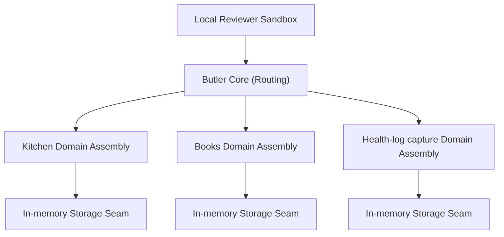

# Architecture Overview: agentic-domain-runtime

This document outlines the high-level architecture of `agentic-domain-runtime`, explaining the relationship between the platform core and domain assemblies.

## Component Overview

### 1. Runtime/Bootstrap
The runtime acts as the orchestration shell, initializing configurations and setting up shared resource pools (e.g., HTTP clients, optional Redis connections, storage clients, and LLM providers). The public reviewer path exercises this runtime through a local sandbox, not through a required Telegram bot.

### 2. Butler Core
The Butler Core acts as a stateless, intent-based router. It receives free-form text or media payloads from the local sandbox, analyzes intent via lightweight parsing or LLM orchestration/extraction, and delegates the payload to the appropriate domain assembly. It avoids hardcoded navigation menus, making the interaction flow natural and flexible.

### 3. Domain Assemblies
Domain assemblies represent isolated logical units with their own routers, data validation rules, and storage interfaces:
- **Kitchen**: Manages recipes, capturing ingredient lists and tags, and supporting media batching.
- **Books**: Manages reading library logs and shelf organization.
- **Health-log capture**: Focuses on structured capture/extraction of health-related metrics (e.g., physical parameters, activity notes) and persisting them deterministically.

### 4. Storage Seams
To keep domains decoupled, the architecture implements storage seams. The public reviewer path uses in-memory persistence so it can run offline without database credentials or local infrastructure. The private system can map the same domain boundaries to PostgreSQL/Supabase namespaces, but that production storage layer is outside the initial public reviewer path.

### 5. Observability
Observability is integrated at the core level. The runtime provides structured logging, performance telemetry, and exception tracking across all domains. This allows developers to trace event flow from the local reviewer sandbox input through the LLM extraction step down to database commit.

### 6. Trust Boundaries
- **External Client Interface**: Public verification does not require external client credentials. Telegram and other external adapters are outside the initial public reviewer path.
- **Data Capture Boundary**: The health-log capture domain is limited strictly to deterministic validation and persistence of incoming data. The system does not analyze logs to generate suggestions, decisions, or triage priority.
- **Isolated Storage**: Domain storage access goes through explicit seams to prevent cross-domain coupling.
