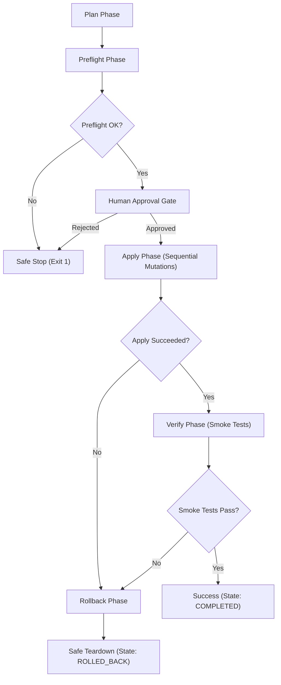

# Live Apply & Deployment Design Specification

This document details the architectural design for the future live deployment and mutation path (`live apply`) of the `agentic-domain-runtime`.

> [!WARNING]
> **Current Status: Design + Alpha**
> This specification is the architectural blueprint for live infrastructure orchestration. A guided wizard v1 alpha (`bootstrap install --yes`) is implemented and proven on Win+WSL2 — covering Supabase live path, existing Render service `/health`, and Telegram webhook. Fresh Render ADR deploy and cleanup live proof remain pending. The design below describes the full target architecture; sections not yet implemented are explicitly marked.

---

## 1. Objective & Architectural Scope

The goal of the `live apply` command is to transition the multi-domain runtime environment from a local offline bootstrap status into an active, cloud-hosted production deployment.

The runtime must orchestrate three external cloud/API services:
1. **Supabase**: Creating database tables, applying schemas, executing migrations, and enforcing Row-Level Security (RLS) policies.
2. **Render**: Provisioning the application web service, managing environment groups, injecting environment variables, and triggering/monitoring deployments.
3. **Telegram Bot API**: Activating live webhooks and registering bot command layouts.

To ensure stability, safety, and auditability, any mutation must follow a highly structured, step-by-step transaction pipeline.

---

## 2. Pipeline Phases

The deployment lifecycle is divided into five distinct phases. Transition to each next phase is gated by strict success criteria.



### Phase I: Plan
* **Inputs**: Local migration files, configuration files, environment configuration templates (`.env.example`).
* **Actions**:
  - Compare local database schemas with target database version history.
  - Construct a target resource topology graph.
  - Generate an execution checklist (plan) detailing all intended mutations.
* **Outcome**: A deterministic JSON plan and a user-friendly terminal output showing exactly what will change.

### Phase II: Preflight
* **Inputs**: Target API endpoints, credentials/access tokens.
* **Actions**:
  - Run read-only diagnostic requests to verify authorization.
  - Validate Render account limits and service name availability.
  - Test Telegram bot token validity (via `getMe`).
  - Verify that the target Supabase organization/project exists and is accessible.
* **Outcome**: Verification that all external APIs are reachable and credentials are correct before executing any mutations.
* **CLI Contract (Safe Preflight)**:
  - `uv run python -m src.sandbox bootstrap apply --preflight --read-only`: Performs offline and read-only diagnostics of environment readiness.
  - `uv run python -m src.sandbox bootstrap apply --preflight --read-only --json`: Outputs the preflight check status in machine-readable JSON using `BootstrapState` / `BootstrapStep` vocabulary.
  - **Safety Gate**: Running `--preflight` without `--read-only` or running plain `apply` without `--dry-run` is blocked.


### Phase III: Apply
* **Inputs**: Approved execution plan.
* **Actions**:
  - Execute mutations sequentially (Supabase DB pushes, Render environment group creation, Render Web Service initialization, Telegram webhook configuration).
* **Outcome**: Live resource provisioning and configuration.

### Phase IV: Verify (Smoke Tests)
* **Inputs**: Newly deployed service URLs and test scenarios.
* **Actions**:
  - Trigger synthetic transactions and health checks against the live webhooks and servers.
* **Outcome**: Final validation of system health.

### Phase V: Rollback
* **Inputs**: Execution log of the current deployment run.
* **Actions**:
  - In case of any failure in the Apply or Verify phases, revert changes in reverse order to return to a known stable state.
* **Outcome**: System returned to previous clean state.

---

## 3. Human Approval Boundaries

To prevent unauthorized or accidental production changes, a hard boundary is enforced between read-only plans and state mutations.

* **Explicit GO Gate**: The CLI must halt execution after the `Plan` and `Preflight` phases. It will display the generated plan and prompt for manual confirmation:
  ```text
  [?] Do you want to apply the above plan and mutate production resources? (yes/no)
  ```
  Execution will only proceed if the user types `yes`.
* **State Mismatches**: If `Preflight` detects that a resource already exists but is not managed by this bootstrap instance (e.g. a database containing unrecorded tables), the tool will exit with a warning and require an explicit override flag (`--force-overwrite`) alongside the human approval step.

---

## 4. Secrets Handling & Security Hygiene

Managing live secrets requires strict hygiene to prevent credentials from leaking into Git history, logs, or diagnostic payloads.

### Required Secrets
* `SUPABASE_ACCESS_TOKEN` / `SUPABASE_DB_PASSWORD`: Required to authenticate CLI schema updates.
* `RENDER_API_KEY`: Required to orchestrate hosting resources.
* `TELEGRAM_BOT_TOKEN`: Required to map webhook destinations.

### Supabase Reviewer Onboarding Notes

For reviewer/test setups:

- Supabase CLI login can use browser auth from a clean Docker operator environment.
- If `supabase orgs list --output json` returns an existing organization, use it only after human confirmation.
- If it returns `[]`, the deployer can create a neutral organization with `supabase orgs create "ADR Reviewer"`.
- Project creation should target Frankfurt / `eu-central-1`.
- Do not pass `--size nano` for free-tier creation; let Supabase choose the free-tier compute size.
- Remote `supabase db push` does not apply `seed.sql`; apply public-safe `seed.sql` explicitly before running `smoke.sql`.

### Storage & Input Protocols
1. **No Disk Persistence for Secrets**: Secrets must never be written to local state files (such as `.bootstrap-state.json`) or temporary files.
2. **Environment Variable Injection**: Secrets must be read directly from the parent shell environment variables or inputted interactively via masked terminal prompts.
3. **Console and Log Scrubbing**:
   - All diagnostic logging and console output must automatically sanitize secret patterns.
   - For example, if `TELEGRAM_BOT_TOKEN` is detected in a planned Render env variable group output, it must be replaced with `[REDACTED]` or `*` masks.
   - Standard output traces must only output resource IDs, never credential values.

### 4.4 Local State File Contract

To track execution progress safely and support resumption/cleanup after partial apply runs, a local state file contract is established:
1. **File Location**: By default, the state file is written to `.bootstrap-state.json` at the workspace root.
2. **Git Protection**: The file `.bootstrap-state.json` must be explicitly listed in `.gitignore` to prevent committing local environment metadata to git.
3. **Non-Secret Content**: The file only stores metadata, current initialization/execution status, and the planned resource topologies from `generate_bootstrap_plan`. It must never store tokens, database passwords, or secret environment variables.
4. **CLI Commands**:
   - `uv run python -m src.sandbox bootstrap state --init [--path <path>] [--overwrite] [--dry-run] [--json]`
     Initializes the non-secret state file. Fails if the file already exists unless `--overwrite` is specified.
   - `uv run python -m src.sandbox bootstrap state --show [--path <path>] [--json]`
     Reads and displays the current state file summary. Fails if the file does not exist.

---

## 5. State Transitions

The bootstrap process relies on a vocabulary representing the environment's state. The table below maps state transitions during `live apply` runs:

| Step / Env State | Trigger | Next State | Condition |
| :--- | :--- | :--- | :--- |
| `BLOCKED` | CLI Initialization | `READY` | Preflight checks pass (doctor returns OK) |
| `READY` | Plan generation completes | `REQUIRES_APPROVAL` | Dry-run is false, plan is ready |
| `REQUIRES_APPROVAL` | User inputs `yes` | `APPLYING` | Human confirmation received |
| `REQUIRES_APPROVAL` | User inputs `no` or timeout | `MUTATION_PREVENTED` | Action aborted safely |
| `APPLYING` | Step execution fails | `FAILED` | Internal step failure |
| `APPLYING` | All steps execute successfully | `VERIFYING` | Transitioning to verification |
| `VERIFYING` | Smoke tests pass | `COMPLETED` | System is online and healthy |
| `VERIFYING` | Smoke tests fail | `FAILED` | Degraded service behavior detected |
| `FAILED` | Rollback trigger | `ROLLING_BACK` | Initiating safe-teardown |
| `ROLLING_BACK` | Rollback completes successfully | `ROLLED_BACK` | System reverted to previous state |
| `ROLLING_BACK` | Rollback fails | `DEGRADED_CRITICAL` | Manual human intervention required |

---

## 6. Rollback Strategy

If a step fails during `Apply` or `Verify`, the system must attempt a controlled rollback. Because cloud mutations are not fully transactional across different vendors, rollback is handled per-resource and can degrade to a manual intervention state.

### 1. Supabase (Database)
* **Risk**: Partially applied migrations.
* **Strategy**:
  - Before running `supabase db push`, execute a database schema backup/snapshot.
  - If a migration fails, apply a revert migration sequence or restore the database schema to the snapshot.
  - If it is a new project setup, delete the newly created Supabase project.

### 2. Render (Web Hosting)
* **Risk**: Partially created services or broken environment variables.
* **Strategy**:
  - If the Web Service fails to deploy, delete the created service instance using Render REST API.
  - If updating an existing service, restore the previous deployment build version or rollback the environment variables to their cached preflight state.

### 3. Telegram Webhook
* **Risk**: Webhook points to a broken or non-existent endpoint, disabling the bot.
* **Strategy**:
  - During the `Preflight` phase, query the current webhook URL via `getWebhookInfo`.
  - If smoke tests fail, call `setWebhook` with the original URL to restore communication.

### 4. Rollback/Cleanup Preview (Safe Dry-Run)
Before executing a live rollback or cleanup, operators can preview the actions using a local-only dry-run preview:
* **Command**: `uv run python -m src.sandbox bootstrap cleanup --preview --local [--state-path <path>] [--json]`
* **Behavior**: Displays the source of truth (plan or state file), resources and their status (e.g. `planned_not_created`, `created`), and lists the cleanup actions in reverse dependency order (Telegram -> Render -> Supabase -> Local State). It blocks live mutations and requires both flags.

---

## 7. Smoke / Verification Contract

After resources are applied, the `Verify` phase validates the setup with a deterministic contract:

1. **Local and Cloud Health Probe**:
   - Query `/health` on the Render web service URL.
   - Expect: `HTTP 200 OK` with JSON payload list of active agents (e.g. `{"status": "ok", "agents": ["butler", "kitchen", "books", "health"]}`).
   - For Supabase + Render wiring, `/health` must also report whether persistence is `memory` or `supabase`, whether DB env is configured, and whether a safe DB readiness check passed.
2. **Synthetic Message Webhook Test**:
   - Send a synthetic POST request resembling a Telegram update object to the Render webhook endpoint.
   - Expect: `HTTP 200 OK` with verified domain classification results.
3. **Invalid Webhook Gate Check**:
   - Send a malformed payload (missing message text).
   - Expect: `HTTP 400 Bad Request` with structured error explanations.

---

## 8. Failure Modes & Safe Stop Conditions

* **Preflight Token Expiration**: If an API key expires mid-run, execution must halt instantly before any subsequent phase.
* **Teardown Timeout**: If a Render resource removal fails or hangs during rollback, the runtime must not infinite loop. It must timeout after 60 seconds, output all current resource IDs, and transition to `DEGRADED_CRITICAL` to warn the developer of potential cloud billing issues.
* **Partial State Recovery**: If the deployment tool crashes mid-apply, it should write progress to a backup state file to allow a subsequent execution to resume or cleanup the dangling resources.
