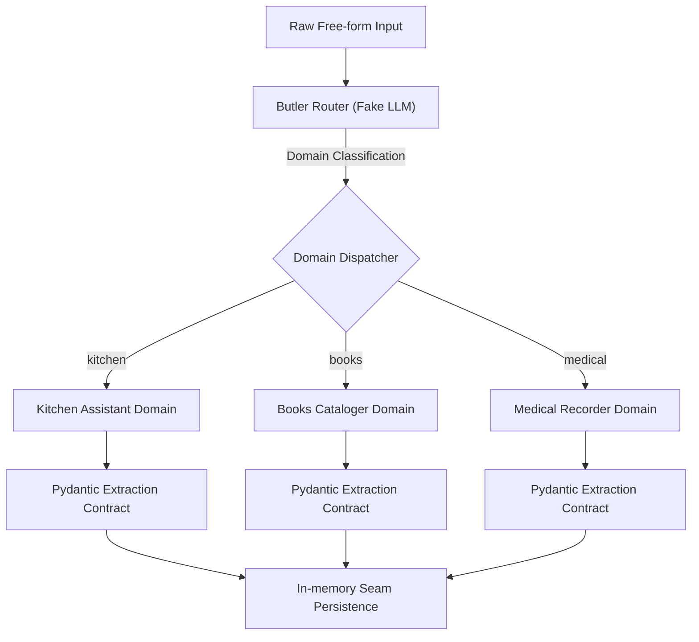

# Private-to-Public Lineage

This document describes the architectural lineage, transformation path, and extraction boundaries that define the relationship between the private production system and this public repository (`agentic-domain-runtime`).

---

## 1. The Private Source System

The private production system is an active family assistant platform that runs on live infrastructure. Its primary components include:

- **Conversational Adapter Surface**: A Telegram Bot (powered by `aiogram` 3.x) and a Telegram Mini WebApp (React frontend) enabling multi-modal interaction (text, voice transcripts, photo captures).
- **Data namespaces & Storage**: A PostgreSQL database hosted on Supabase. Relational tables are organized into specific namespaces (`core`, `kitchen`, `books`, `med`, `api`) utilizing strict Row-Level Security (RLS) policies mapping to verified Telegram user IDs.
- **State & Queue Management**: A Redis instance handling FSM (Finite State Machine) transitions, request batching (to prevent DB write bursts), and session lock patterns.
- **Deployment**: Automatic containerized deployment via Render.
- **Core Assets**: Real-world family recipes, cataloged books, health telemetry logs, and raw LLM conversation trace files.

---

## 2. The Public Repository Boundary

The extraction process transforms a complex private system into a clean, public-safe architectural blueprint. The public boundary enforce the following rules:

- **No Live Infrastructure**: All cloud infrastructure configurations, Render deployment descriptors (`render.yaml`), and database connection parameters are excluded.
- **No Private Credentials**: Hardcoded tokens, service role keys, API endpoints, and private repo URLs are completely removed.
- **No Production Adapters**: The Telegram Bot loop and WebApp code are excluded, leaving the domain services cleanly decoupled.
- **No Real User Data**: Production database records, backups, conversational traces, personal family names, and actual telemetry logs are omitted. All data is replaced by synthetic json scenario fixtures.
- **No Process Artifacts**: Agent task lists, development logs (`.agents/`), and private developer prompts are strictly kept outside the public slice.

---

## 3. Preserved Architectural Patterns

The public slice preserves and showcases the core reusable runtime patterns of the private application:

- **Butler-first Free-input Routing**: Demonstration of how free-form user messages are parsed to identify the target domain and intent before execution.
- **Domain Assemblies Separation**: Strict boundary isolation where each domain (Kitchen, Books, Medical) owns its schema contracts, validation decorators, and logic.
- **LLM Extraction & Validation**: Clean partitioning of LLM-assisted structural parsing from deterministic validation rules.
- **Decoupled Persistence Interfaces**: Service interfaces that represent PostgreSQL database boundaries, implemented here via clean, mock in-memory stores.
